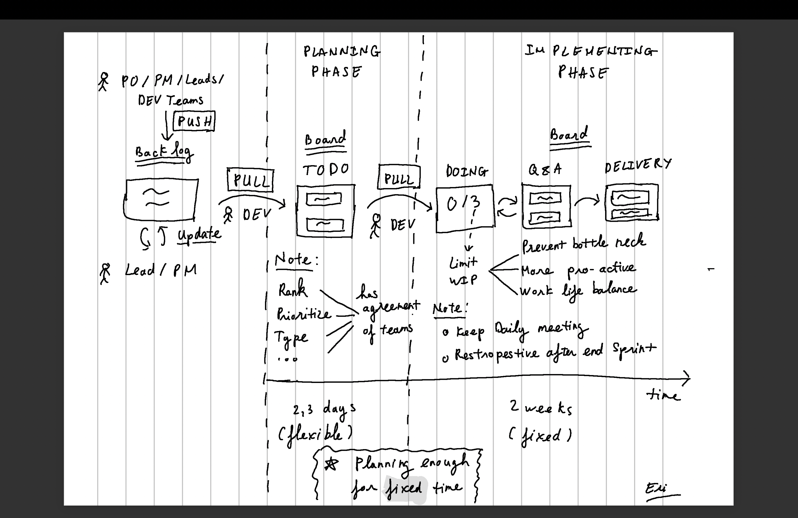

:::note[Series]
Mình sẽ chia thành nhiều phần, để mọi người dễ đọc hơn. Series sẽ bao gồm:

- [Phần 1: Giới thiệu các yếu tố của Scrumban.](/posts/scrum-ban-part-1/)
- [Phần 2: Scrumban workflow và các yếu tố có thể ảnh hưởng trong quá trình vận hành.](/posts/scrum-ban-part-2/)
  :::

> Hi mọi người, nay mình sẽ dùng một cách diễn đạt mới, đa phần sẽ thông qua hình ảnh. Mình nghĩ, sẽ dễ tiếp cận hơn, giảm bớt thời lượng đọc. Với hình ảnh sẽ có nhiều góc nhìn, nên rất mong nhận được sự chia sẻ của mọi người.

## Scrumban Workflow

Ở hình trên, mình mô tả full workflow của Srumban, bên cạnh đó mình có để một số "Ghi chú" để bổ sung thông tin, nhầm quá trình vận hành trong dự án thực tế sẽ rõ ràng hơn.

Mình đã thử áp dụng cho dự án của công ty và mình rút ra được hai yếu tố chính có thể ảnh hưởng trực tiếp tới quá trình vận hành Scrumban:

1. Vì vẫn là một framework dựa theo mô hình Agile => **yếu tố minh bạch** về thông tin là tối quan trọng (các thành viên cần chủ động, thường xuyên cập nhật thông tin lên board).

2. Pull ticket được chia sẻ cho team member => cá nhân cần có **kỹ năng quản lý workload, planning task**.

:::tip
Cá nhân mình khi ở vai trò là Scrum Master, thực tế quá trình vận hành Scrumban cũng không được suôn sẻ. Vấn đề của mình là mặc dù đã chia sẻ thông tin với các thành viên nhưng lại thiếu mất việc **cung cấp phương tiện**.

Cụ thể như là: Scrumban yêu cầu cá nhân pro-active và có kỹ năng hơn trong việc chủ động quản lý ticket nhưng với các bạn mới các kỹ năng trên được hiểu khá mơ hồ.

=> Ngoài truyện giới thiệu định nghĩa, mình sẽ tìm cách cung cấp thêm công cụ, phương tiện để tăng khả năng thực hiện.
:::
